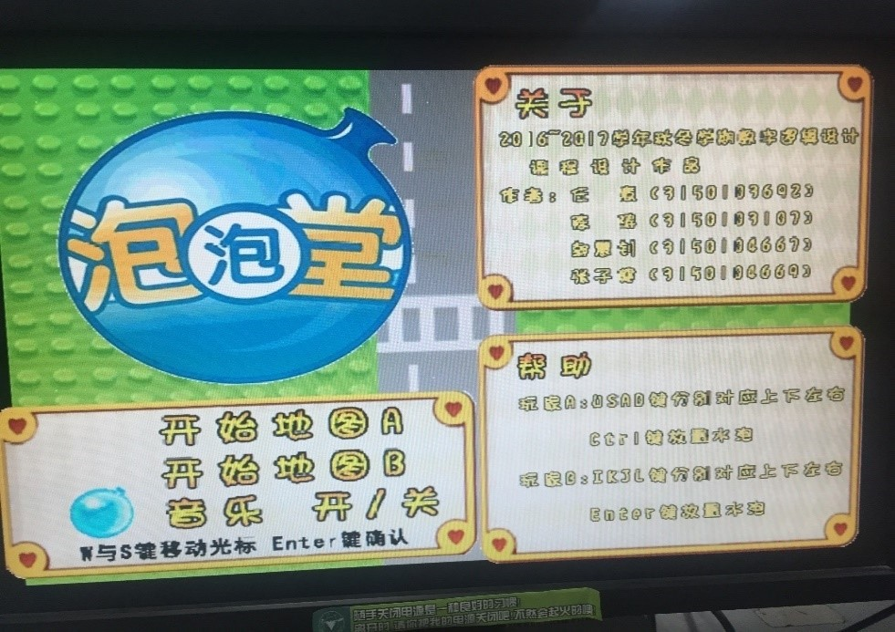

# Verilog-BNB

## 简介

- 基于FGPA的泡泡堂游戏。
- 主要实现了以下几个功能：
  - 玩家对战，键盘控制，屏幕显示，音乐播放，以及其他一些辅助功能。泡泡堂的实现采用SWORD实验板，通过接口连接VGA显示器，PS2键盘，内置按键与数码管以及外置扬声器实现基本的I/O交互。

## 系统演示与操作说明

### 开始界面，按WS可上下切换，按Enter键确认

### 地图1

   玩家1使用WASD控制上左下右的移动，ctrl键释放泡泡
   玩家2使用IJKL控制上左下右的移动，enter键释放泡泡
   

### 地图2

